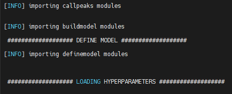
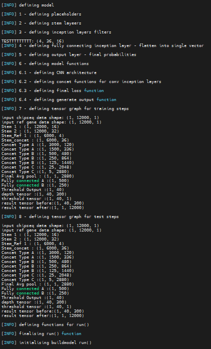
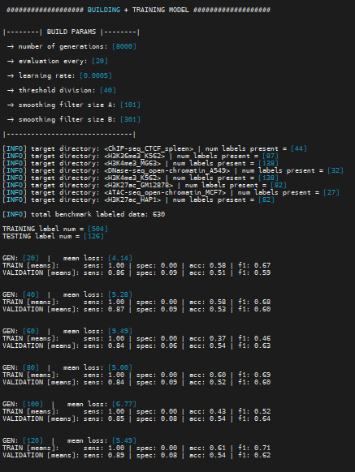
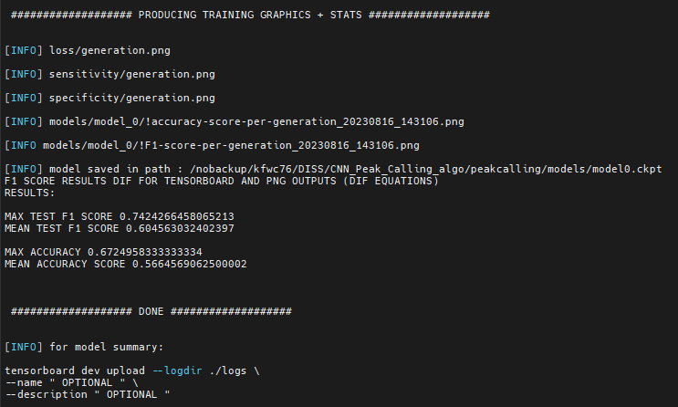
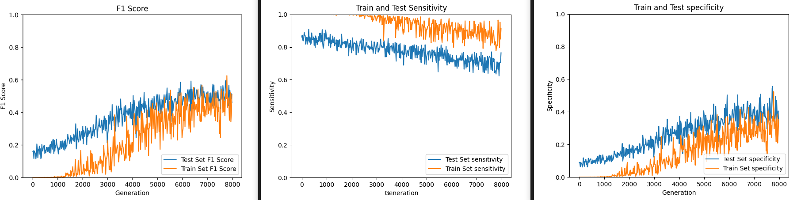
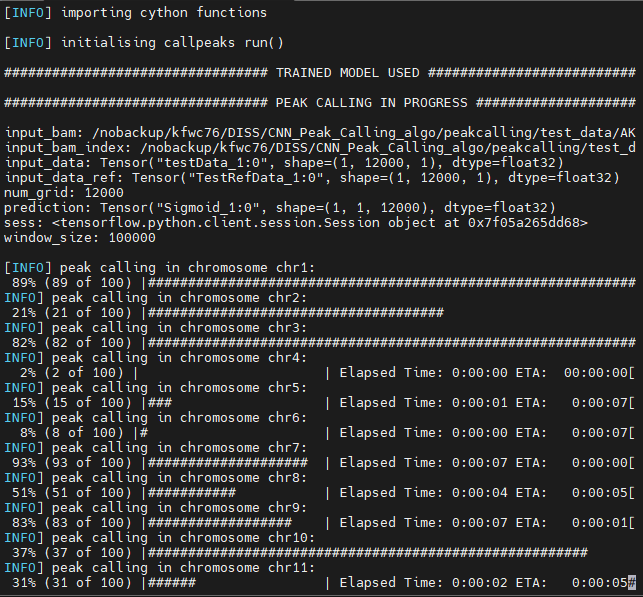

Detailed docs can be found in paper/supplementary data [M&M]:

workflow: <br>
1 -	Data Acquisition and Selection <br>
2 -	ChIP-seq Pipeline <br>
3 -	Peak calling <br>
4 -	EDA, Prediction and Visualisation of TFBMs <br>
5 -	EDA, Prediction and Visualisation of TFBMs <br>
6 -	CNN Data Preprocessing <br>
7 -	CNN Model Architecture <br>
8 -	Evaluation, Loss Function and Peak scoring<br>
9 -	CNN Training<br>
10 - Hyperparameter Optimisation<br>
11 - CNN Peak Calling<br>
12 - Comparative Analysis<br>
RESULTS<br>

-----------------------

# [1] preprocessing data (bioinfo pipeline)

requirements: samtools/bamtools/fastqc/multiqc/bowtie/macs2

Obtain FASTQ + Control raw data from ENCODE
Use src/ scripts to QC/trim/align/sort/index -> output = .bam

## [1.1] MACS2 peakcalling (standard pipeline)


<ins>!!! ChIPseq_CNN/pipeline_scripts/ 1-6 (.sh) !!!</ins>

<br>

-----------------------

# [2] CNN peak calling model

REQUIREMENTS.TXT for module version control/install (virtualenv)

<br>

## [2.1] preprocess data for CNN

aligned BAM ChIP-seq
label data
ref seq files

```sh
python preproc.py
```

<p align="left">
    
</p>

fragments input data into label/depth/refseq data

test/train data outputs

<br>

## [2.2] buildmodel

for hyperparam optimisation + building models + evaluation of models
call
```sh
python buildmodel.py
```
hyperparams = define hyperparams:

<p align="left">
    
</p>

definemodel = model architecture:

<p align="left">
    
</p>

buildmodel = split data/statistics/generations/train params/output+save learned weights:

<p align="left">
    
</p>


workflow:
```sh
run() -> hyperparameters.py -> definemodel.py -> buildmodel.py -> trained output model + eval stats
```
outputs model + eval stats:

<p align="left">
    
</p>

<p align="left">
    
</p>
(unoptimised hyperparams)

<br>

## [2.3] using trained model to predict peaks

requires cythonating C files found in setup.py 
calls all buildmodel scripts BUT with learned model

call
```sh
python callpeaks.py
```

<p align="left">
    
</p>

<br>

## [2.4] output processing

output peak files + test model metrics

call
```sh
python makeScore.py
python errorCall.py
```
compare to traditional methods (MACS2 etc)

######################################################

<br>

-----------------------

# [3] final comparisons + motif output

<br>

outputs:
MACS2 .bed
CNN .bed

<br>

<ins>!!! ChIPseq_CNN/pipeline_scripts/ 7-10 (.sh) !!!</ins>

deeptools fpr heatmap plots and profiles
correlation metrics

DREAM for motif analysis
Read paper for more info

<br>
