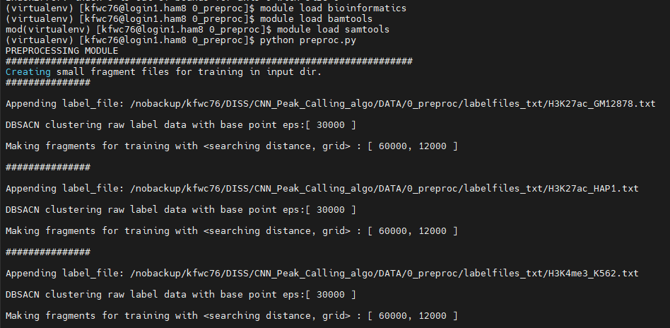

# CNN Framework to train and test models on ChIP-seq datasets

CNN-Peaks published model is no longer available, hindering its use as a tool for novel models to benchmark against. To try and solve this problem, I have modified the original framework down to a few python scripts for people to build form themselves. This is a "lite" version of CNN_peaks, enabling the model to run using a single Python script and allowing for complete modification of the training/test data and core architecture.

This pipeline also includes a ChIP-seq pipeline (FASTA -> BAM -> bigWig) + visualisation, skip these steps if required.

<p style="color:red",  font-size:2.5em>[Currently a WIP as of 29/08/23]</p>

Workflow: <br>

| Step | Info | Location | Script |
| :-------------: |:-------------:| :-------------: | :-------------: |
| 1 | Data Acquisition and Selection | _/pipeline_scripts & /data_folder_ | **.sh** |
| 2 | ChIP-seq Pipeline | _/pipeline_scripts & /data_folder_ | **.sh** |
| 3 | Peak calling (MACS2) | _/pipeline_scripts & /data_folder_ | **.sh** |
| 4 | EDA, Prediction and Visualisation of TFBMs | _/pipeline_scripts & /data_folder_ | **.sh** |
| 5 | Functional Analysis & Motif Discovery | _/pipeline_scripts & /data_folder_ | **.sh** |
| 6 | CNN Data Preprocessing | _/CNN_peak_prediction/preprocessing_ | **preproc.py** |
| 7 | CNN Model Architecture | _/CNN_peak_prediction/buildmodel_ | **definemodel.py** |
| 8 | Evaluation, Loss Function and Peak scoring | _/CNN_peak_prediction/peakcalling_ |  **buildmodel.py** |
| 9 | CNN Training | _/CNN_peak_prediction_ | **buildmodel.py OR callpeaks.py** |
| 10 | Hyperparameter Optimisation | _/CNN_peak_prediction/buildmodel_ | **hyperparameters.py** |
| 11 | CNN Peak Calling | _/CN_peak_prediction/peakcalling_ | **callpeaks.py** |
| 11.5 | Evaluation | _/CNN_peak_prediction/outputs_ | **errorCall.py** |
| 12 | Comparative Analysis | _/pipeline_scripts & /data_folder_ | **.sh** |

Detailed documentation can be found in Section 3 (Methodology)

## Description

WIP

## Getting Started

WIP

### Dependencies

* pipeline_scripts prerequisites can be found within the shell scripts (1-5, 12), these were designed for implementation on Linux
* The CNN python prerequisites + versions can be found within CNN_peak_prediction/requirements.txt (6-11)
* This pipeline and the python scripts were designs to run on a Linux terminal, however these should be compatible with any python interpreter

### Installing (WIP)

* Shell scripts require the an array of modules, these depend on the individual job
* Note: samtools/htslib packages need to be manually installed for the cython scripts within the callpeaks.py

### Executing program

* The ChIP-seq pipeline shell scripts are to be ran in the order as listed (they should auto order when listed by name)
   - 1_fetch&QC.sh
   - 1_multiqc.sh
   - 2_trim.sh
   - 3_bowtie_alignment.sh
   - 3_bt2-builder.sh
   - 5_samtools_sort_index.sh
   - 6_macs.sh
   - 7_0_deeptools_bamCoverage.sh
   - 7_1_deeptools_bamcompare_normalisation.sh
   - 7_2_1_deeptools_computematrix_normreps.sh
   - 7_2_deeptools_comparematrix.sh
   - 7_3_1_deeptools_plotprofile_NORM.sh
   - 7_3_deeptools_plotprofile.sh
   - 7_4_deeptools_headmap.sh
   - 7_5_deeptools_QC.sh
   - 7_6_2_deeptools_QC_PCR.sh
   - 7_6_deeptools_QC_plotcorrlation.sh
   - 8_motif_discovery_prep.sh

* The CNN scripts can be copied and individually used at each stage by running >python [script]
* These tasks should be executed in the general order as outlined below, ensure all prerequisite data is made available and modules are loaded:
```
0 - this part of the project was run virtualenv, create + activate this if required, install requirements.txt
0 - preproc.py, formatting.py, label_preproc.py (preprocessing scripts) <br>
0 - hyperparameters.py (does not need to be ran [called in buildmodel/callpeaks] - optimise as required) <br>
0 - definemodel.py (does not need to be ran [called in buildmodel/callpeaks]) <br>
1 -	buildmodel.py (run for training evaluation) <br>
2 - cythonation scripts need to be ran here to link C scripts - refer to CNN_Peaks github
3 - callpeaks.py (run for training + testing) (ensure test data is available) (may have to point directory to correct libraries if errors) <br>
4 - errorCall.py - for evaluation of CNN rpedictions (ensure you have test label data)
```

## Help

Any advise for common problems or issues.
```
Many of the errors I ran into have been put into print statements, a common reoccuring error happens during callpeaks.py the first time its ran due to a linking error to the C script htslib library, to fix: LD_LIBRARY_PATH=/bamdepth/htslib_1_9/

Other errors that could occur could be due to incompatible libraries / module versions
```

## Acknowledgments

Inspiration, code snippets, etc.
* [CNN_Peaks](https://github.com/odb9402/CNNPeaks)
* [LanceOTron](https://github.com/LHentges/LanceOtron)
* [GoogLeNet](https://github.com/conan7882/GoogLeNet-Inception)

## To do
* Update codebase to TF2 or PyTorch
* Resolve cython issues
* Improve reproducability

-----------------------

## Walkthrough

# [1] preprocessing data (bioinfo pipeline)

requirements: samtools/bamtools/fastqc/multiqc/bowtie/macs2

Obtain FASTQ + Control raw data from ENCODE
Use src/ scripts to QC/trim/align/sort/index -> output = .bam

## [1.1] MACS2 peakcalling (standard pipeline)


<ins>!!! ChIPseq_CNN/pipeline_scripts/ 1-6 (.sh) !!!</ins>

<br>

-----------------------

# [2] CNN peak calling model

REQUIREMENTS.TXT for module version control/install (virtualenv)

<br>

## [2.1] preprocess data for CNN

aligned BAM ChIP-seq
label data
ref seq files

```sh
python preproc.py
```

<p align="left">
    
</p>

fragments input data into label/depth/refseq data

test/train data outputs

<br>

## [2.2] buildmodel

for hyperparam optimisation + building models + evaluation of models
call
```sh
python buildmodel.py
```
hyperparams = define hyperparams:

<p align="left">
    
</p>

definemodel = model architecture:

<p align="left">
    
</p>

buildmodel = split data/statistics/generations/train params/output+save learned weights:

<p align="left">
    
</p>


workflow:
```sh
run() -> hyperparameters.py -> definemodel.py -> buildmodel.py -> trained output model + eval stats
```
outputs model + eval stats:

<p align="left">
    
</p>

<p align="left">
    
</p>
(unoptimised hyperparams)

<br>

## [2.3] using trained model to predict peaks

requires cythonating C files found in setup.py 
calls all buildmodel scripts BUT with learned model

call
```sh
python callpeaks.py
```

<p align="left">
    
</p>

<br>

## [2.4] output processing

output peak files + test model metrics

call
```sh
python makeScore.py
python errorCall.py
```
compare to traditional methods (MACS2 etc)

######################################################

<br>

-----------------------

# [3] final comparisons + motif output

<p align="left">
    
</p>

<br>

outputs: <br>
MACS2 .bed <br>
CNN .bed <br>

<br>

<ins>!!! ChIPseq_CNN/pipeline_scripts/ 7-10 (.sh) !!!</ins>

deeptools fpr heatmap plots and profiles
correlation metrics

DREAM for motif analysis
Read paper for more info

<br>
