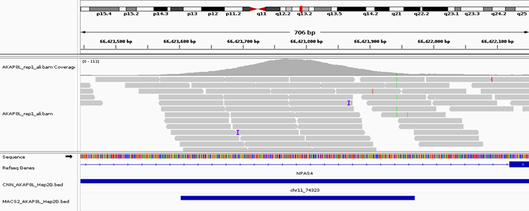

# Supplementary data

*Ref* | *Image* | *Info* |
|:--|:--:|:--|
1 || ChIP-seq Pipeline: Heatmap plotCorrelation used to examine read coverage similarity to perform heirarchial clustering between AKAP8L CHIP-seq reps (clustering of reps and control – similarity).
2 || ChIP-seq Pipeline: PCA (principal component analysis) for read coverage calculations. Used to determine whether samples display greater variability between experimental conditions then between AKAP8L replicates of the same treatment based on read coverage values information.
3 || MACS2: gene over-representaiton (GO database)
4 || MACS2: gene over-representaiton (KEGG database)
5 || Labelling AKAP8L test data example (red region indicates the peak recognised) (for evaluation metrics - error script)
6 || Labelling AKAP8L test data example
7 || CNN: gene over-representaiton (GO database)
8 || CNN: gene over-representaiton (KEGG database)
9 || COMPARISON: Example of highly significant enrichment peak called by both the CNN and MACS2 (NPAS4)
10 || COMPARISON: Statistical data
11 || COMPARISON: Distribution of features
12 || COMPARISON: Distribution of identified TF binding loci relative to TSS
13 || COMPARISON: Gene over-representation comparison between MACS2 and CNN peak calling models. Combined enrichment analysis between AKAP8L peak calling models using the KEGG database.
